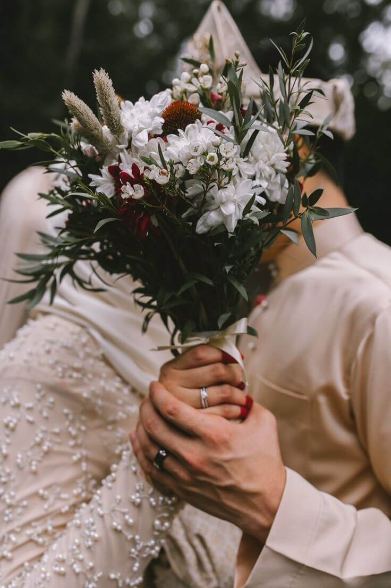

# 💍 The Royal Wedding - Undangan Digital Cinematic



> Project undangan pernikahan digital dengan standar "High-End", mengutamakan pengalaman pengguna yang imersif, interaktif, dan performa tinggi.

Berbeda dengan undangan website biasa yang kaku, project ini dibangun menggunakan teknologi web modern (**Vue 3 + GSAP**) untuk menciptakan nuansa mewah layaknya website brand fashion internasional.

🔗 **Lihat Demo:** [Masukkan Link Vercel/Netlify Anda Di Sini]

## ✨ Fitur Unggulan (Kenapa Ini Premium?)

### 🎬 Pengalaman Sinematik
* **Opening Ken Burns:** Efek masuk dramatis dengan zoom perlahan dan tipografi elegan, bukan sekadar gambar diam.
* **Lenis Smooth Scroll:** Sensasi scrolling yang "licin" dan berbobot (inertial scroll), memberikan kesan mahal saat digulir.
* **Smart Audio:** Musik latar yang memutar otomatis (Auto-play) dengan transisi volume (Fade-in) yang lembut, lengkap dengan tombol kontrol piringan hitam (Vinyl).

### 🧊 Elemen 3D & Interaktif
* **Micro-Luxury Cards:** Kartu informasi acara yang bereaksi terhadap gerakan mouse (Desktop) atau kemiringan HP (Gyroscope), memberikan efek 3D nyata.
* **Efek Sorotan Cahaya:** Efek spotlight dinamis yang mengikuti kursor di atas kartu hitam.
* **Gift Vault 3D:** Kartu rekening/e-wallet dengan efek hologram dan kedalaman visual (depth).
* **Divider Kinetik:** Garis pembatas antar halaman yang "menggambar" dirinya sendiri saat di-scroll.

### ⚡ Performa Prioritas Utama
* **Anti-Lag:** Animasi berat dinonaktifkan secara cerdas di perangkat HP Low-end untuk menjaga kelancaran 60fps.
* **GPU Acceleration:** Menggunakan teknik `will-change` agar animasi dirender oleh GPU, bukan CPU.
* **Aset Ringan:** Menggunakan tekstur PNG terkompresi menggantikan SVG filter yang berat.

## 🛠️ Teknologi yang Digunakan

* **Framework:** [Vue.js 3](https://vuejs.org/) (Composition API)
* **Build Tool:** [Vite](https://vitejs.dev/) (Super Cepat)
* **Styling:** [Tailwind CSS](https://tailwindcss.com/)
* **Animasi:**
    * [GSAP](https://greensock.com/) + ScrollTrigger (Animasi Kompleks)
    * [AOS](https://michalsnik.github.io/aos/) (Animasi Masuk Sederhana)
* **Smooth Scroll:** [Lenis](https://lenis.studio/)

## 📂 Struktur Folder

```bash
src/
├── assets/images/    # Foto-foto (Prewed, Background) - Wajib dikompres
├── components/       # Komponen Vue Modular
│   ├── Opening.vue   # Halaman Pembuka (Cover)
│   ├── Hero.vue      # Foto Utama Parallax
│   ├── Event.vue     # Kartu Acara 3D
│   ├── Gift.vue      # Amplop Digital 3D
│   ├── Gallery.vue   # Galeri Foto Cinematic
│   └── ...
├── App.vue           # Logika Utama (Musik & Scroll)
└── style.css         # Konfigurasi Global Tailwind
public/
├── audio/            # File Lagu (wedding-song.mp3)
└── thumbnail.jpg     # Gambar Preview untuk Share WhatsApp
